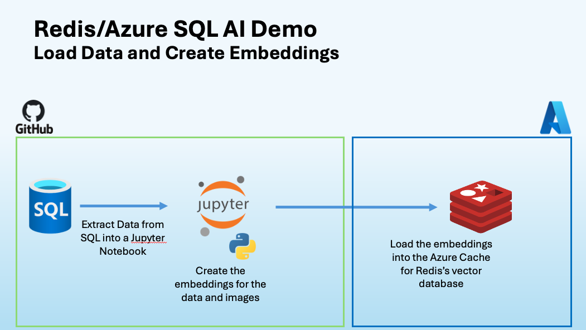
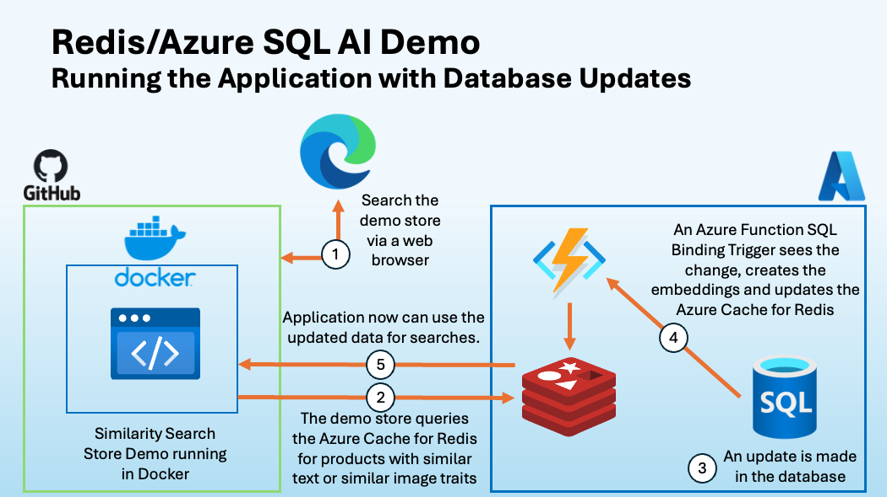

# Redis Vector Search Demo Application using ACRE and Cache Prefetching from Azure SQL with Azure Functions

## Summary

We based this project from our [Product Search Demo](<https://github.com/redis-developer/redis-product-search>) which showcase how to use Redis as a Vector Db. We modified the demo by adding a Cache Prefetching pattern from Azure SQL to ACRE using Azure Functions. The Azure Function uses a SQL Trigger that will trigger for any updates that happen in the table.

## Features

- Uses Azure Function to sync the updates in Azure SQL to Redis using a Prefetch caching pattern
- Vector Similarity Search
  - by image
  - by text
- Multiple vector indexing types
  - HNSW
  - Flat (brute-force)
- Hybrid Queries
  - Apply tags as pre-filter for vector search

## Architecture

### Load Data and Create Embeddings



### Running the Application with Database Data Updates



## Prerequisites

- VS Code, Visual Studio, or run this in a codespace!
- Python 3.8
- OSX or Windows
- Azure SQL
- Azure Cache for Redis Enterprise
  - Configuration steps [here](https://learn.microsoft.com/en-us/azure/azure-cache-for-redis/quickstart-create-redis-enterprise)

## Running the Solution

### Step 1 - Create a SQL Database and load the products data

In the first part of this demo solution, you will be loading a SQL database with the product information used for the application and for creating embeddings for the Redis vector database. The steps for this part of the demo solution can be found in this [README](./data/README.md)

### Step 2 - Create the embeddings from the data in the database

This [Jupyter notebook](./data/prep_data.ipynb) will create two json files with the product metadata and the product vectors. These files will be placed in the data folder. The application will load these files to ACRE and create the indexes automatically when the application docker container starts. You can run these steps by running the cells in this [Jupyter notebook](./data/prep_data.ipynb).

### Step 3 - Run the App

1. Fill in the Redis values in the .env file

  ```BASH
  REDIS_HOST=''
  REDIS_PORT=''
  REDIS_PASSWORD=''
  ```

1. Create the application docker image by running

  ```BASH
  docker build -t product-search-app . --no-cache
  ```

1. Export Redis Endpoint Environment Variables:

  ```BASH
  $ export REDIS_HOST=your-redis-host
  $ export REDIS_PORT=your-redis-port
  $ export REDIS_PASSOWRD=your-redis-password
  ```

1. Run docker image by running

  ```BASH
  docker compose -f docker-cloud-redis.yml up
  ```


### Step 4 - Run the Azure Function

1. Go to the sqlTrigger folder by running

  ```sh
  cd sqlTrigger
  ```

1. Run the Azure Function

  ```sh
  func start
  ```

### Datasets

The dataset was taken from the the following Kaggle links.

- [Large Dataset](https://www.kaggle.com/datasets/paramaggarwal/fashion-product-images-dataset)
- [Smaller Dataset](https://www.kaggle.com/datasets/paramaggarwal/fashion-product-images-small)