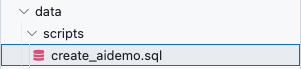
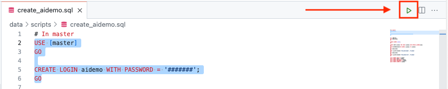
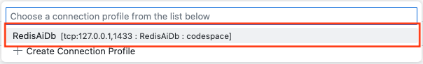
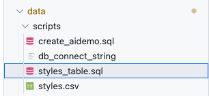

# Creating Embeddings and Loading the Database

In this folder are all the componets you need for loading the SQL Server/Azure SQL database with the product data as well as creating embeddings to be used with the Redis Vector Database.

## About the Data

The application uses a static dataset of products from Kaggle. There are two
versions that can be used for the demo

 - [Small](https://www.kaggle.com/datasets/paramaggarwal/fashion-product-images-dataset) (~.5 GB)
 - [Large](https://www.kaggle.com/datasets/paramaggarwal/fashion-product-images-small) (~25 GB)


The small dataset is currently used so that the container remains small but the process is similar for the
larger dataset. The small dataset is included in this repository as the styles.csv file.


### Product Metadata

The file ``styles.csv`` contains the product metadata needed for the demo.

Columns and datatypes of the metadata are listed below.
```text
Int64Index: 44077 entries, 0 to 44423
Data columns (total 10 columns):
 #   Column              Non-Null Count  Dtype
---  ------              --------------  -----
 0   id                  44077 non-null  int64
 1   gender              44077 non-null  object
 2   masterCategory      44077 non-null  object
 3   subCategory         44077 non-null  object
 4   articleType         44077 non-null  object
 5   baseColour          44077 non-null  object
 6   season              44077 non-null  object
 7   year                44077 non-null  int64
 8   usage               44077 non-null  object
 9   productDisplayName  44077 non-null  object
dtypes: int64(2), object(8)
memory usage: 3.7+ MB
```

### Product Images

The images are included in the repository (/redis-azure-ai-demo/app/vecsim_app/static/images) and will be embedded using the prep_data python notebook.

## Getting Started

For the SQL database, you can choose to use an Azure SQL Database or use a local SQL Server database in a container. If using an Azure SQL Database, you can skip to the **Loading the Data** section. If you want to use a SQL Server Database in a local container, this section will walk you through the creation process.

### Installing go-sqlcmd for local database development

First, we need to install sqlcmd so that we can create and interact with our database. Start by running the following commands: 

```BASH
curl https://packages.microsoft.com/keys/microsoft.asc | sudo tee /etc/apt/trusted.gpg.d/microsoft.asc
sudo add-apt-repository "$(wget -qO- https://packages.microsoft.com/config/ubuntu/20.04/prod.list)"
sudo apt-get update
sudo apt-get install sqlcmd
```

then, run the following commands to create the database:

```BASH
sqlcmd create mssql -u RedisAiDb --accept-eula
```

Next, we need to see the connect string information so that we can connect to the database in the next section. Run the following command:

```BASH
sqlcmd config connection-strings
```

## Loading the Data

The following section will guide you through loading the styles.csv file into the database.

### Connect to the database

1. To interact with the SQL Database, use the **SQL Server (mssql)** extension.

    

1. Once the extension is installed, use the left side and click the SQL Extension on the left side.

    

1. Next, click **Add Connection** in the SQL Extension.

    

1. On the top of the codespace, a dialog box will appear asking for a **Server Name or ADO.NET connection string**.

    

    Enter the ADO.NET Connect string of your database. The previous connecting string command supplied it for you and if using an Azure SQL Database, you can find the ADO.NET connecting string on the portal under Connect Strings. Then press enter/return in the dialog box.

1. The next dialog box asks you to **name the connection profile**. Name it **RedisAiDb** and press enter/return.

   

### Create the users and schema

1. In the scripts directory in the data directory is the file create_aidemo.sql. 

    

    Click on this file to bring it up in the code editor.

1. To start, change the password of the aidemo login from ####### to a complex, secure password.

    ```SQL
    CREATE LOGIN aidemo WITH PASSWORD = '#######';
    ```

1. Once the password is changed, highlight the following SQL and click the green run button to execute it.

    ```SQL
    USE [master]
    GO

    CREATE LOGIN aidemo WITH PASSWORD = '#######';
    GO
    ```

    

    ***REMEMBER TO CHANGE THE PASSWORD TO A COMPLEX, SECURE PASSWORD BEFORE RUNNING THIS SQL!**

1. Upon clicking the run button, a dialog box will appear asking which SQL connection you want to use. Select our RedisAiDb connection.

    

1. Highlight the next section and again use the green arrow to run this SQL.

    ```SQL
    USE [RedisAiDb]
    GO

    CREATE SCHEMA aidemo;
    GO

    CREATE USER [aidemo] FOR LOGIN [aidemo] WITH DEFAULT_SCHEMA=[dbo]
    GO
    ALTER AUTHORIZATION ON SCHEMA::[aidemo] TO [aidemo]
    GO
    USE [RedisAiDb]
    GO
    EXEC sp_addrolemember N'db_datareader', N'aidemo'
    GO
    USE [RedisAiDb]
    GO
    EXEC sp_addrolemember N'db_datawriter', N'aidemo'
    GO

    grant CREATE TABLE to aidemo;
    grant CREATE VIEW to aidemo;
    grant CREATE FUNCTION to aidemo;
    grant CREATE PROCEDURE to aidemo;
    grant CREATE SCHEMA to aidemo;
    ```

### Create the table and load the data

1. Next, we need to create the table that will hold the data from the styles.csv file. Using the File Explorer, find the styles_table.sql file in the data/scripts directory.     

    

    Click on this file to bring it up in the code editor.

1. Highlight the following SQL and click the green run button to execute it. You may need to again choose a database profile as we did when running code from the create_aidemo.sql script.

    ```SQL
    create table [aidemo].[styles] (
    id              int NOT NULL PRIMARY KEY CLUSTERED,
    gender          nvarchar(50) NOT NULL,
    masterCategory  nvarchar(100) NOT NULL,
    subCategory     nvarchar(100) NOT NULL,
    articleType     nvarchar(100) NOT NULL,
    baseColour      nvarchar(50) NOT NULL,
    season          nvarchar(50) NOT NULL,
    year            int,
    usage           nvarchar(100) NOT NULL,
    productDisplayName  nvarchar(2000) NOT NULL
    )
    ```

1. Right click on the connection name in the connection navigator on the left side and choose **New Query**.

    

1. With the new query window in the code editor, copy and paste the following SQL but do not run it yet.

    ```SQL
    BULK INSERT [aidemo].[styles]
        FROM '/styles.csv'
        WITH
        (
        FIRSTROW = 2,
        FIELDTERMINATOR = ',',  --CSV field delimiter
        ROWTERMINATOR = '\n',   --Use to shift the control to next row
        TABLOCK
        )
    ```

    This SQL will load a file from the file system directly into our styles database table. But first, we need to copy this file into the docker container or if you are using an Azure SQL Database, to a container that the database can read from.

1. Using the terminal in codespace, issue the following command:

    ```BASH
    cd /workspaces/redis-azure-ai-demo/data/scripts
    ```

1. Now, we need to file the name of our docker container. Issue the following command:

    ```BASH
    docker ps
    ```

    You will see output similar to the following:

    ```BASH
    CONTAINER ID   IMAGE                                   COMMAND                  CREATED          STATUS          PORTS                    NAMES
    9b6daee8a91e   mcr.microsoft.com/mssql/server:latest   "/opt/mssql/bin/perm…"   39 minutes ago   Up 39 minutes   0.0.0.0:1433->1433/tcp   vigilant_cray
    ```

    The data we want is in the **NAMES** column. Here my container is named "vigilant_cray". 

1. With the docker container name, run the following command. Remember, you docker container name will be different and you will need to replace DOCKER_CONTAINER_NAME with your container's name.

    ```BASH
    docker cp styles.csv DOCKER_CONTAINER_NAME:/.
    ```

    If the file copied into the container, you will see a message similar to the following:

    ```BASH
    Successfully copied 4.33MB to vigilant_cray:/.
    ```

1. Now, back in the code editor, the SQL command we copy and pasted, hight the SQL code and click the green run button.

    If the command was successful, you will see output similar to the following:

    ```SQL
    Started executing query at Line 1
	(44446 rows affected) 
	Total execution time: 00:00:00.715
    ```

1. To see the rows in the table, you can run the following SQL:

    ```SQL
    select * from [aidemo].[styles];
    ```

### Prepare the .env file for the python notebook

1. We need to see the connect string so that we can add this information to our .env file combined with our aidemo user/login. Run the following command:

    ```BASH
    sqlcmd config connection-strings
    ```

1. Next, in the codespace file explorer, copy the template.env file and rename it to **.env**.

1. Looking at the file, you see the following:

    ```BASH
    DB_SERVER = ''
    DB_NAME = ''
    DB_USERNAME = ''
    DB_PASSWORD = ''
    DB_LIMIT=100
    REDIS_HOST=''
    REDIS_PORT=''
    REDIS_PASSWORD=''
    REDIS_KEY=':vecsim_app.models.Product:index'
    REDIS_SSL=False
    ```

1. Using the information from the connect strings, fill in the values for DB_SERVER and DB_NAME and save the .env file:

    ```BASH
    DB_SERVER = ''
    DB_NAME = ''
    ```

1. Using the password you gave to aidemo, fill in the next values for DB_USERNAME (aidemo will be the value here) and DB_PASSWORD and save the .env file:

    ```BASH
    DB_USERNAME = ''
    DB_PASSWORD = ''
    ```

1. The last step in this section is to install the [ODBC 18 Driver](https://learn.microsoft.com/en-us/sql/connect/odbc/linux-mac/installing-the-microsoft-odbc-driver-for-sql-server). Use the existing terminal in codespace or create a new one and run the following code:

    (A script containg this code is also found in the repository here: [odbcDriverInstallUbuntu.txt](../sqlTrigger/odbcDriverInstallUbuntu.txt))

    ```BASH
    if ! [[ "18.04 20.04 22.04 23.04" == *"$(lsb_release -rs)"* ]];
    then
        echo "Ubuntu $(lsb_release -rs) is not currently supported.";
        exit;
    fi

    curl https://packages.microsoft.com/keys/microsoft.asc | sudo tee /etc/apt/trusted.gpg.d/microsoft.asc

    curl https://packages.microsoft.com/config/ubuntu/$(lsb_release -rs)/prod.list | sudo tee /etc/apt/sources.list.d/mssql-release.list

    sudo apt-get update
    sudo ACCEPT_EULA=Y apt-get install -y msodbcsql18
    # optional: for bcp and sqlcmd
    sudo ACCEPT_EULA=Y apt-get install -y mssql-tools18
    echo 'export PATH="$PATH:/opt/mssql-tools18/bin"' >> ~/.bashrc
    source ~/.bashrc
    # optional: for unixODBC development headers
    sudo apt-get install -y unixodbc-dev
    ```

1. The database is now ready to use used by the python notebook prep_data.ipynb to create embeddings to be loaded into the Redis vector database. Please open the prep_data.ipynb and start stepping through the cells.