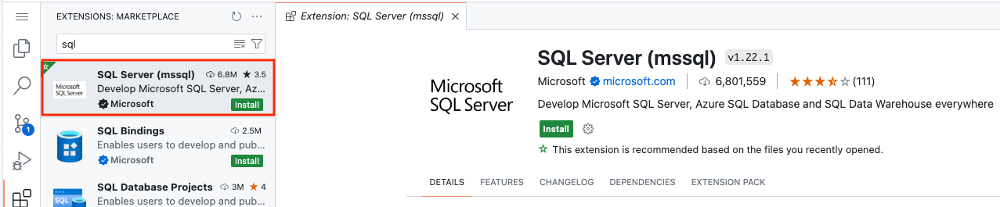
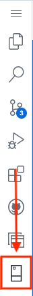
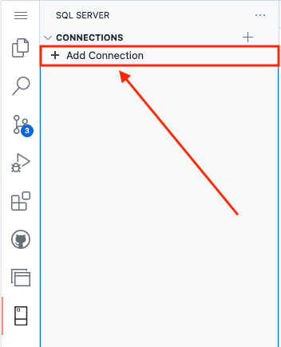
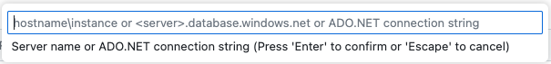
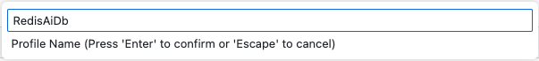
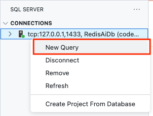

# Creating Embeddings and Loading the Database

In this folder are all the componets you need for loading the SQL Server/Azure SQL database with the product data as well as creating embeddings to be used with the Redis Vector Database.

## About the Data

The application uses a static dataset of products from Kaggle. There are two
versions that can be used for the demo

 - [Small](https://www.kaggle.com/datasets/paramaggarwal/fashion-product-images-dataset) (~.5 GB)
 - [Large](https://www.kaggle.com/datasets/paramaggarwal/fashion-product-images-small) (~25 GB)


The small dataset is currently used so that the container remains small but the process is similar for the
larger dataset. The small dataset is included in this repository as the styles.csv file.


### Product Metadata

The file ``styles.csv`` contains the product metadata needed for the demo.

Columns and datatypes of the metadata are listed below.
```text
Int64Index: 44077 entries, 0 to 44423
Data columns (total 10 columns):
 #   Column              Non-Null Count  Dtype
---  ------              --------------  -----
 0   id                  44077 non-null  int64
 1   gender              44077 non-null  object
 2   masterCategory      44077 non-null  object
 3   subCategory         44077 non-null  object
 4   articleType         44077 non-null  object
 5   baseColour          44077 non-null  object
 6   season              44077 non-null  object
 7   year                44077 non-null  int64
 8   usage               44077 non-null  object
 9   productDisplayName  44077 non-null  object
dtypes: int64(2), object(8)
memory usage: 3.7+ MB
```

### Product Images

The images are included in the repository (/redis-azure-ai-demo/app/vecsim_app/static/images) and will be embedded using the prep_data python notebook.

## Getting Started

For the SQL database, you can choose to use an Azure SQL Database or use a local SQL Server database in a container. If using an Azure SQL Database, you can skip to the **Loading the Data** section. If you want to use a SQL Server Database in a local container, this section will walk you through the creation process.

### Installing go-sqlcmd for local database development

First, we need to install sqlcmd so that we can create and interact with our database. Start by running the following commands: 

```BASH
curl https://packages.microsoft.com/keys/microsoft.asc | sudo tee /etc/apt/trusted.gpg.d/microsoft.asc
sudo add-apt-repository "$(wget -qO- https://packages.microsoft.com/config/ubuntu/20.04/prod.list)"
sudo apt-get update
sudo apt-get install sqlcmd
```

then, run the following commands to create the database:

```BASH
sqlcmd create mssql -u RedisAiDb --accept-eula
```

Next, we need to see the connect string so that we can add this information to our .env file. Run the following command:

```BASH
sqlcmd config connection-strings
```

Copy the template.env file and rename it to just **.env**.

Looking at the file, you see the following:

```BASH
DB_SERVER = ''
DB_NAME = ''
DB_USERNAME = ''
DB_PASSWORD = ''
DB_LIMIT=100
REDIS_HOST=''
REDIS_PORT=''
REDIS_PASSWORD=''
REDIS_KEY=':vecsim_app.models.Product:index'
REDIS_SSL=False
```

Using the information from the connect strings, fill in the values for the following and save the .env file:

```BASH
DB_SERVER = ''
DB_NAME = ''
DB_USERNAME = ''
DB_PASSWORD = ''
```

## Loading the Data

The following section will guide you through loading the styles.csv file into the database.

### Connect to the database

1. To interact with the SQL Database, use the **SQL Server (mssql)** extension.

    

1. Once the extension is installed, use the left side and click the SQL Extension on the left side.

    

1. Next, click **Add Connection** in the SQL Extension.

    

1. On the top of the codespace, a dialog box will appear asking for a **Server Name or ADO.NET connection string**.

    

    Enter the ADO.NET Connect string of your database. The previous connecting string command supplied it for you and if using an Azure SQL Database, you can find the ADO.NET connecting string on the portal under Connect Strings. Then press enter/return in the dialog box.

1. The next dialog box asks you to **name the connection profile**. Name it **RedisAiDb** and press enter/return.

   

1. Once connected to the database, right click on the connection name in the connection navigator on the left side and choose **New Query**.

    

### Create the users and schema

In the scripts directory in the data dire4ctory is the file create_ai